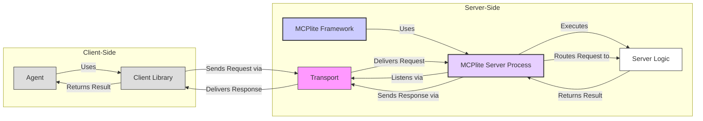

**Core Concept:**

MCPlite is designed as a **Python MCP server framework**, similar in concept to FastAPI. Its primary purpose is to allow developers to easily define and expose **server-side capabilities** (like tools, functions, or access to resources) that can be programmatically invoked by AI agents in a host application.



Transport mechanisms:
- "Direct" (this is literally just importing the code and running the methods directly)
- "HTTP" -- this is not yet with MCP spec, which emphasizes streaming with stdio/SSE.
- "stdio" -- fully in compliance with MCP
- "SSE" -- """

**1. Building the Server (Developer Workflow):**

- **Initialization:** A developer starts by creating an instance of the main framework class:
    
    Python
    
    ```
    from mcp_lite import MCPlite
    app = MCPlite()
    ```
    
- **Defining Capabilities:** The developer defines standard Python functions that implement the desired capabilities. They use **decorators** provided by the `app` object to register these functions with the framework. These decorators tell MCPlite how the function should be exposed (e.g., as a callable "tool").
    
    Python
    
    ```
    @app.tool(name="add", description="Adds two numbers")
    def add_numbers(a: int, b: int) -> int:
        return a + b
    
    @app.resource(uri="resource://data/items")
    def get_items():
        # Logic to retrieve items
        return {"items": ["apple", "banana"]}
    ```
    
    - The decorators handle registering the function, potentially validating input/output types, and making metadata (like names, descriptions, schemas) available.
- **Running the Server:** The developer starts the server process, which will listen for incoming requests:
    
    Python
    
    ```
    if __name__ == "__main__":
        app.run(host="0.0.0.0", port=8000) # Example run command
    ```
    

**2. The Running MCPlite Server:**

- Once `app.run()` is executed, a server process starts.
- It **listens** on a specified network interface and port (e.g., via HTTP).
- It waits for incoming **requests**. These requests are expected to follow a specific **protocol** defined by MCPlite (likely a structured JSON format, potentially resembling JSON-RPC, specifying the desired method/capability and arguments, based on your earlier `chaintest.py` example).
- Upon receiving a valid request, the server **parses** it, identifies the target capability (e.g., the "add" tool), and **routes** the request to the corresponding decorated Python function (`add_numbers`).
- It **executes** the target function with the provided arguments.
- It takes the function's return value, **formats** it into a response payload (again, likely structured JSON).
- It **sends** the response back to the client that made the request.

**3. Client Interaction:**

- On the other side, a **client application** (which might contain your `Agent` class) wants to use the capabilities exposed by the MCPlite server.
- This client application typically uses a **`Client Library`** (represented by your `Client` class).
- The `Client Library` is responsible for:
    - Knowing how to communicate with the MCPlite server (e.g., the server's address and port).
    - (Potentially) Discovering the available capabilities and their required parameters from the server, perhaps via a special metadata endpoint provided by MCPlite.
    - Taking instructions from the `Agent` (e.g., "call the 'add' tool with a=5, b=3").
    - **Formatting** these instructions into the specific JSON request format that the MCPlite server expects.
    - Handling the underlying network **transport** (e.g., making the HTTP request).
    - Receiving and **parsing** the JSON response from the server.
    - Returning the result to the `Agent`.
- The `Agent` interacts with the `Client Library` at a higher level, focusing on _what_ capability to use, rather than the low-level details of request formatting and network communication.

**Overall Goal:**

The MCPlite framework aims to bridge the gap between high-level agent logic (potentially driven by an LLM) and concrete server-side functions. It provides a standardized way for developers to expose capabilities and for agents (via a client library) to discover and invoke them reliably.
